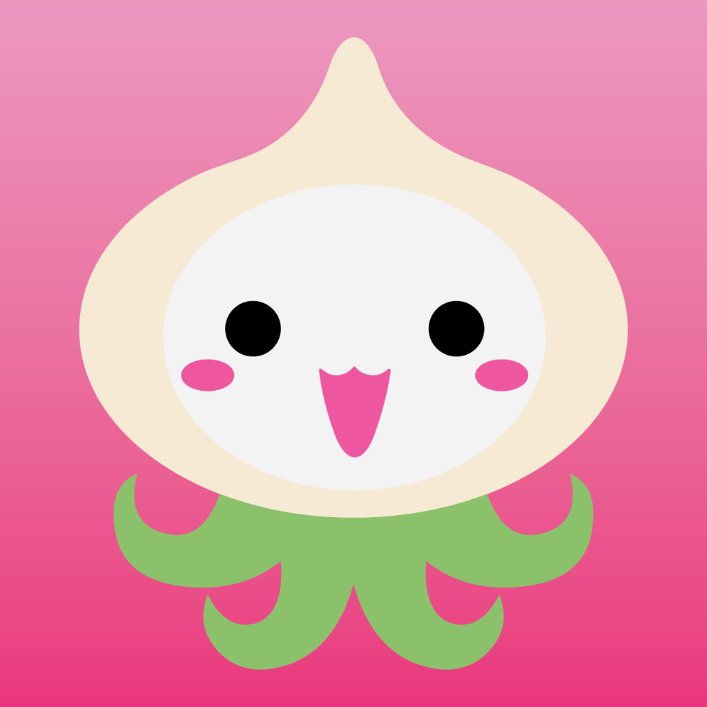

# OverBronze

> 🕹️ Overwatch themed discord bot




[](https://github.com/pankaryp/OverBronze.git)
[](https://github.com/pankaryp/OverBronze.git)

[](https://codeclimate.com/github/pankaryp/OverBronze/maintainability)
[](https://codeclimate.com/github/pankaryp/OverBronze/test_coverage)
[](https://travis-ci.org/pankaryp/OverBronze)


#### Note : This is a self hosting bot. Meaning you must host it and mantain it yourself.

### Features

* Top overwatch player stats for competitive games
* Top overwatch hero stats 
* Random overwatch sounds
* Random overwatch pictures
* Swear detector and some special other word detectors

### Prerequisites

* Ffmpeg
* Node.js

### Getting Started
In order to host the bot you must create a config folder inside your root directory with a keys.js file inside.
```javascript
#Inside keys.js

module.exports = {
    botToken: 'YOUR_BOT_TOKEN_HERE'
}
```

### Contributing

If something is unclear, wrong, or needs to be refactored, please let me know. Pull requests are always welcome. Please open an issue before submitting a pull request. 

### License

This project is licensed under the MIT License - see the [LICENSE.md](LICENSE.md) file for details.

